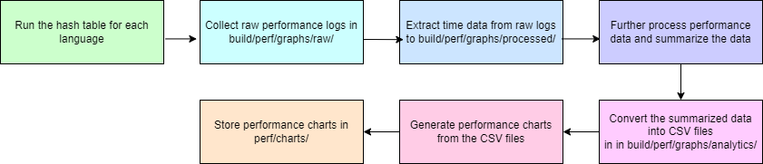

# Swiss Hash Table

## Project folder structure

-   `src/C/` - has hash table C implementation source code
-   `test/C/` - has hash table C test source code
-   `src/ASM/` - has hash table Assembly implementation source code
-   `build` - has compiled bytecodes for the hash table
-   `perf` - has hash table implementations of other languages (C Swiss
    project, C++ standard library, C++ Abseil\'s, Java, Python, C# hash
    tables) for performance analysis
-   `platforms` - has compiled bytecodes for the hash table for mutiple
    processor architecutres
    -   `ARM`, `Intel x64`, `RISC-V` and `Web-Assembly` platforms are
        present

## How to run the Swiss Hash Table project

-   `C` project has 4 parts.
    -   Run the tests for C Swiss code correctness.
    -   Run the performance scripts to generate performance charts.
    -   Optional: Run the project for different processor platforms
    -   Optional: Run the Assembly (NASM) Swiss hash table project

Refer below for each part of the project. The 3rd point is optional for
different processor environments.

-   4 different processor types are covered
    -   INTEL is 1
    -   WASM is 2
    -   ARM is 3
    -   RISCV is 4
-   If processor type is not mentioned then default is INTEL.

### 1. Run the tests for C Swiss code correctness.

Follow the below steps.

-   Install `gcc 12.2.0+`, `curl`, `emcc 3.1.27+`
    -   `curl` is needed to download `emcc` and build it for WebAssembly
        setup.
        -   `emcc` installation can be different based on the OS type.
            `./perf/scripts/c/install-wasm.sh` installs `emcc 3.l.27` on
            Linux/Ubuntu OS.
-   Execute the following command based on the OS and processor type you
    are using.
    -   Processor type should be passed as an argument to the
        `run_c.sh`. Tested values are `INTEL`, or `ARM`. `WASM`, or
        `RISCV` are also supported.

``` python
%%bash
chmod 777 ./test/C/bdd/run_c.sh
./test/C/bdd/run_c.sh INTEL
```

``` python
%%bash
chmod 777 ./perf/scripts/c/install-wasm.sh
./perf/scripts/c/install-wasm.sh

chmod 777 ./test/C/bdd/run_c.sh
./test/C/bdd/run_c.sh WASM
```

``` python
%%cmd
test\C\bdd\run_c.bat
```

##### 1.1 File generated by the above command

-   C Swiss hash table linkable object file is created first in
    `build/intel/hashtable.o`.
-   `./test/C/bdd/` C test files are linked with the above object file
    as a library then they are executed to verify correctness of the C
    Swiss hash table library.

### 2. Run the performance scripts to generate performance charts.

-   Performance of 6 different hash tables from different languages are
    being compared in this effort.
    -   6 different hash tables from different languages are the
        following.
        -   C Swiss hash table
        -   C++ standard library\'s hash table
        -   C++ Abseil library\'s Swiss hash table
        -   Python hash table
        -   Java hash table
        -   C# hash table
-   Install `Java 11+`, `Python 3.10.11+`, `dotnet 9.0.102+`,
    `cmake 3.31.5+`, and `git`
    -   This assumes `gcc` was installed already as of the previous
        prerequisite.
    -   `git` is needed to clone C++ Abseil Swiss hash table library.
-   Install `pip 23.0.1+`
    -   This is needed to generate performance charts.
    -   Install the following Python libraries to generate performance
        charts
        -   `pip3 install pandas`
        -   `pip3 install matplotlib`

#### 2.1 Hash table impelemtation code

-   Each language\'s hash table implementation can be found in the below
    locations.
    -   C Swiss hash table: `perf/c/`
    -   C++ standard library\'s hash table: `perf/cpp/basic/`
    -   C++ Abseil library\'s Swiss hash table: `perf/cpp/swiss/`
    -   Python hash table: `perf/python/`
    -   Java hash table: `perf/java/`
    -   C# hash table: `perf/cs/`
-   Scripts to run above codes for performance are in the following
    locations.
    -   C Swiss hash table: `perf/scripts/c/`
    -   C++ standard library\'s hash table: `perf/scripts/cpp/basic/`
    -   C++ Abseil library\'s Swiss hash table:
        `perf/scripts/cpp/swiss/`
    -   Python hash table: `perf/scripts/python/`
    -   Java hash table: `perf/scripts/java/`
    -   C# hash table: `perf/scripts/cs/`

#### 2.2 How to run the different hash table impelementations

-   Running all the hash table implementations are automated in to below
    single script.

    -   This script may take around 1 hour to complete the execution.

-   This diagram explains what below command does.

    # 

##### 2.3.1 Windows:

``` python
%%cmd
perf\scripts\run.bat
```

##### 2.3.2 Ubunut(Linux)

To execute C++ Abseil Swiss hash table code, generate performance data
and graps, C++ Abseil library needs to be installed before running the
performance script. The below has scripts needs to be run based on the
OS. `build.sh` is for Ubuntu and `build-yum.sh` is for Linux yum. It is
different for Mac OS. Please refer Abseil documentation for more
information.

``` python
%%bash
chmod 777 ./perf/scripts/cpp/build-yum.sh
./perf/scripts/cpp/build-yum.sh
# chmod 777 ./perf/scripts/cpp/build.sh
# ./perf/scripts/cpp/build.sh
```

-   Execute the following command based on the OS and processor type you
    are using.
    -   Processor type should be passed as an argument to the `run.sh`.
        Tested values are `INTEL`, or `ARM`. `WASM`, or `RISCV` are also
        supported.

``` python
%%bash
chmod 777 ./perf/scripts/run.sh
./perf/scripts/run.sh INTEL
```

-   `emcc` installation can be different based on the OS type.
    `./perf/scripts/c/install-wasm.sh` installs `emcc 3.l.27` on
    Linux/Ubuntu OS.

``` python
%%bash
chmod 777 ./perf/scripts/c/install-wasm.sh
./perf/scripts/c/install-wasm.sh

chmod 777 ./perf/scripts/run.sh
./perf/scripts/run.sh WASM
```

#### 2.3 Performance comparison charts

-   Performance graphs can be found in `perf/charts/`
-   To download all the charts, execute the bleow command on your
    localhost.
    -   Replace `<username>`, `<host>`, `<base path>` of the below
        command
    -   Host used for testing is `ada.cas.mcmaster.ca`

``` python
%%bash
scp -r <username>@<host>:<base path>/swiss-hash-table/perf/charts/ .
```

##### 2.4 File generated by the above command

-   Locations of the files generated for the performance measurements
    and final charts are the following.
    -   `build/perf/graphs/raw/` contains direct log files from the
        different implementations with time logs.
    -   `build/perf/graphs/processed/` contains organized time logs
        extracted from `raw` logs
    -   `build/perf/graphs/analytics/` contains CSV files with time data
        further processed from above files.
    -   `perf/charts/` contains performance measurement graphs to be
        added to the report with time complexity analysis.

### 3. Optional: Run the project for different processor platforms

-   Below are the different processor plaform folders.
    -   ARM: `platforms\arm`
    -   INTEL: `platforms\intel`
    -   RICSV: `platforms\riscv`
    -   WebAssembly: `platforms\wasm` (WebAssembly is not a processsor
        but it is covered as a another high level language)
-   Each platform folder has `Dockerfile`, `Docker-compose.yml`,
    and`entrypoint.sh` files which creates Docker image and container
    with relevant process emulator.
    -   `build,sh` or `build.bat` builds the Docker image.
    -   `run.sh` or `run.bat` creates Docker container from the Docker
        image then runs the C hash table on the relevant processor
        emulator.
-   Below commands for generating C object files.

``` python
%%cmd
gcc -msse2 -DENV=1 -c src\C\hashtable\impl\SwissHashTable.c -o build\intel\hashtable.o
```

``` python
%%bash
gcc -msse2 -DENV=1 -c ./src/C/hashtable/impl/SwissHashTable.c -o ./build/intel/hashtable.o
emcc -fPIC -Wno-implicit-function-declaration -msse2 -msimd128 -DENV=2 -c ./src/C/hashtable/impl/SwissHashTable.c -o ./build/wasm/hashtable.o
arm-none-eabi-gcc -mfloat-abi=softfp -mfpu=neon --specs=rdimon.specs -Wl,--start-group -lgcc -lc -lm -lrdimon -Wl,--end-group -DENV=3 -c ./src/C/hashtable/impl/SwissHashTable.c -o ./build/arm/hashtable.o
riscv64-unknown-elf-gcc -O2 -march=rv64gcv -DENV=4 -c ./src/C/hashtable/impl/SwissHashTable.c -o ./build/riscv/hashtable.o
```

#### 3.1 Run the C test project on different processor environments

-   Install Docker
-   Run below commands to run the tests for correctness on different
    processor environments

``` python
%%bash
./platforms/intel/run.sh
./platforms/wasm/run.sh
./platforms/arm/run.sh
./platforms/riscv/run.sh
```

``` python
%%cmd
platforms\intel\run.bat
platforms\wasm\run.bat
platforms\arm\run.bat
platforms\riscv\run.bat
```

### 4 Optional: Run the Assembly (NASM) Swiss hash table project

``` python
%%bash
./src/ASM/run_asm.sh
```

``` python
%%cmd
src\ASM\run_asm.bat
```
